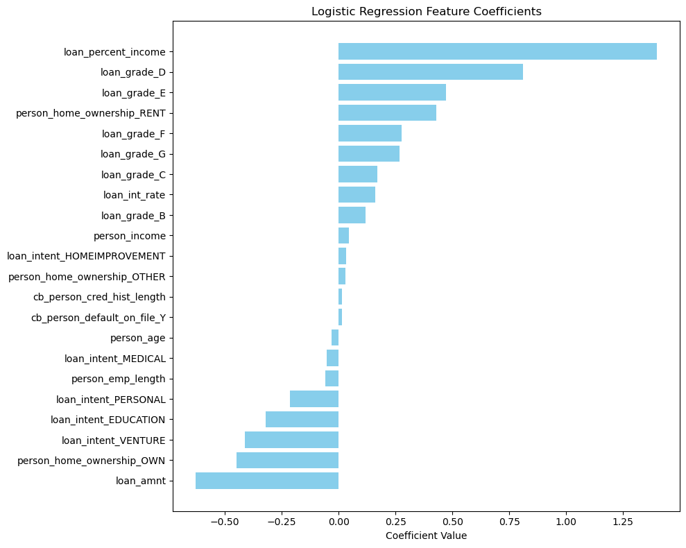
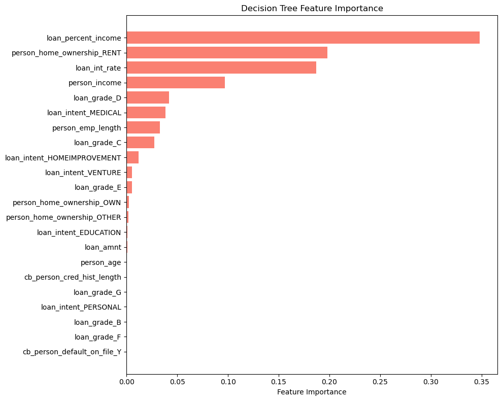
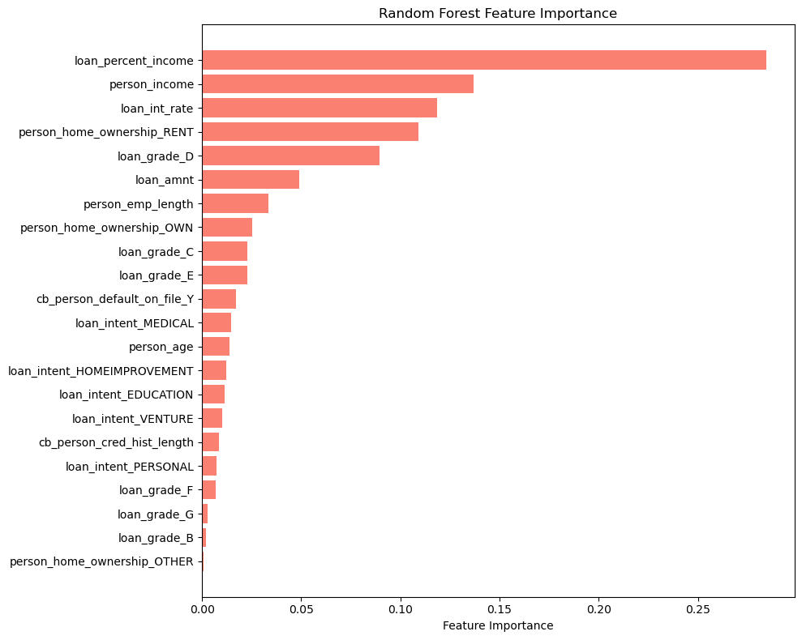

# Task 1: Credit Scoring Model

**Objective**: Predict loan default risk (loan_status: 0 = repay, 1 = default).  
Credit scoring is critical in banking and fintech for managing financial risk.

**Dataset**: credit_risk_dataset.csv (32,581 samples)  
**Target**: Imbalanced (~78% non-default, ~22% default)

## Methodology

**Preprocessing**:
- Outlier capping (e.g., age ≤80, reasonable employment length)
- Median imputation for missing values (loan_int_rate ~9%, person_emp_length ~3%)
- Encoding: Ordinal (loan_grade), One-hot (home_ownership, loan_intent), Binary (cb_person_default_on_file)
- StandardScaler for numerical features
- Stratified train-test split (80/20)

**Models Trained**:
- Logistic Regression (baseline)
- Decision Tree Classifier
- Random Forest (n_estimators=100)
- Voting Classifier (Soft Voting)

## Results

| Model                | Accuracy | Precision | Recall | F1-Score | ROC-AUC |
|----------------------|----------|-----------|--------|----------|---------|
| Logistic Regression | 0.867   | 0.768    | 0.563  | 0.649   | 0.869  |
| Decision Tree       | 0.907   | 0.923    | 0.624  | 0.744   | 0.876  |
| Random Forest       | 0.927   | 0.963    | 0.694  | 0.807   | 0.920  |
| Voting Classifier   | 0.918   | 0.924    | 0.681  | 0.784   | 0.909  |

**Best Model**: Random Forest

## Feature Importance

  
*Figure 1: Logistic Regression Feature Coefficients (Horizontal Bar Plot)*

  
*Figure 2: Decision Tree Feature Importance (Horizontal Bar Plot)*

  
*Figure 3: Random Forest Feature Importance (Horizontal Bar Plot)*

**Top feature across models**: loan_percent_income

## Interpretation and Analysis
- **Logistic Regression**: Provides interpretable coefficients reflecting linear impact on default probability. Positive coefficients increase risk (e.g., high loan_percent_income), negative decrease it (e.g., home ownership OWN). Strong baseline but lower recall.
- **Decision Tree**: Captures non-linear relationships; higher recall than Logistic but risk of overfitting.
- **Random Forest**: Ensemble reduces overfitting, achieves best overall performance and balance. Most suitable for production.
- **Voting Classifier**: Good trade-off, robust on imbalanced data.
- **General**: loan_percent_income is consistently the strongest predictor. Tree-based models better handle interactions vs linear Logistic Regression.

## Remarks and Key Learnings
- Handled outliers, missing values, and class imbalance effectively
- Multiple metrics essential for imbalanced datasets
- Feature importance aids stakeholder communication

## Conclusion
Random Forest is production-ready and demonstrates strong preprocessing, evaluation, and interpretation skills per CodeAlpha guidelines.
